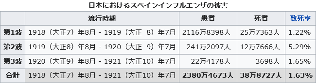

所謂、「1年あっという間」でした。2022年を振り返っておきたい。

「ブログに残さなくてもインターネットを探せば載ってるだろ！」と思いがちです。昔はたしかにそうでした。SNS が浸透したいま、ブログを書く人が減って、「インターネットに載せている人」自体が減っています。

自分の感じた時間の流れを記録することは重要、とつくづく思います。人間の記憶は結構曖昧で、適当なのです。

## 新型コロナウイルス感染症3年目、収束せず

[2020年1月15日に日本で初めての感染者が確認されました](https://www.niid.go.jp/niid/ja/diseases/ka/corona-virus/2019-ncov/2502-idsc/iasr-in/9818-486d01.html)。2022年12月で3年が経過し、2023年で4年目に突入します。

日本で1918年に流行したスペインかぜは、収束まで3年がかかったそうです。コロナウイルスは4年目に入るため、1918年の日本の人たちに2023年の私たちは負けたと言っていいのではないでしょうか。

1918年の医療技術は今と比べたら比較にならないほどだったのに、現代の私たちより早く収束させています。すごい。

<blockquote class="twitter-tweet">
1918年に流行したスペインかぜ、日本で終息まで3年かかった。 コロナウイルス、日本での確認は2020年1月なので1年と8ヶ月経過。 大正時代と令和時代の日本人、どちらか先に終息できるか自分のなかで勝負している。  出典：新型コロナウイルス感染症第一例（国立感染症研究所）<a href="https://t.co/pLfWlFOauz">https://t.co/pLfWlFOauz</a> <a href="https://t.co/GtCJbpmkya">pic.twitter.com/GtCJbpmkya</a>
&mdash; ぼっちざPRiMENON (@PRiMENON) <a href="https://twitter.com/PRiMENON/status/1428336606704898056?ref_src=twsrc%5Etfw">August 19, 2021</a></blockquote> 

出典:[スペインかぜ](https://ja.wikipedia.org/wiki/%E3%82%B9%E3%83%9A%E3%82%A4%E3%83%B3%E3%81%8B%E3%81%9C)（ウィキペディア日本語版）

2021年よりも外出制限が緩くなり、緊急事態宣言もよっぽどのことがない限り発令しなくなりました。マスクの着用や手指の消毒が生活の一部になって、国民は慣れてきたように思います。NHK のインタビューを受けていた人がこう言ってました。

> （コロナは）いつ終わるか分からない、終わらないかもしれない

いつまで続くのか、誰にもわかりません。

## 物価上昇

卵、牛乳、サラダ油、パン、小麦粉、野菜、醤油…数え切れないほどの日用品から食料品まであらゆるものが値上がりしました。

2023年も値上がり続けるんでしょうか。自分たちの給料は上がる気配がないのに…。

## テレワーク、在宅勤務

電車の混み具合はコロナ前に戻ったと感じています。みんな、在宅勤務をやめてしまったんでしょうか。新入社員は「在宅より出社したい」、管理職は「在宅だと部下が仕事しているか分からない」らしいです。

在宅勤務するなら、社員同士のコミュニケーション手段、社員の人事評価、在宅勤務と出社勤務の平等の扱い、在宅勤務でかかる経費の会社負担（電気代など）は会社側が準備する必要はありますので、そこまでカバー出来ない企業はやめたんじゃないかなと。

在宅勤務が日常になると、企業が用意した働きやすいオフィスやフリードリンクを利用する機会が減ってしまい、もったいないですね。そういうのがあるなら、出社したい気持ちも分かります。

## 体重が落とせた

良かったことの一つです。

コロナで外出自粛して、在宅勤務でほぼ自宅にいるのに、食べる量が変わらなかったので体重が増えました。健康診断の体重も毎年上昇していてさすがにこれはまずいと思い、2021年から部屋から出なくても出来る自重トレーニングを始めました。

きっかけは、NHK番組『みんなで筋肉体操』です。筋トレ・ダイエットでやることといえば、ランニング・ジョギング・ジムに通う、だと思います。昔、ランニングやジョギングはやったことがありますが、週末しかやってなくてほとんど体重は落ちず、やめちゃいました。

筋肉体操は外出しなくても、筋トレグッズを買わなくても出来る筋トレだったので、具合が悪い時以外毎日やるようにして、さらに体重を毎日計測するようにしました。

無理しなくていいし、自分が出来る範囲でやることにしてます。自分の場合、例えば腕立て伏せを○回やると回数を決めるのではなく、筋肉体操の動画を見ながら、腕立て伏せの基本に沿って30秒間やる、にしてます。筋肉体操によると、正しいやり方でやれば回数を何回もやる必要はないそうで、腕立て100回とかはやる必要がないみたいです。

結果として、7～8kg減量出来ました。標準体重に近づいて良かったです。

皆さん良いお年をお迎えください。