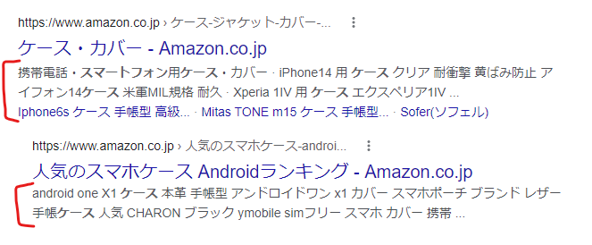
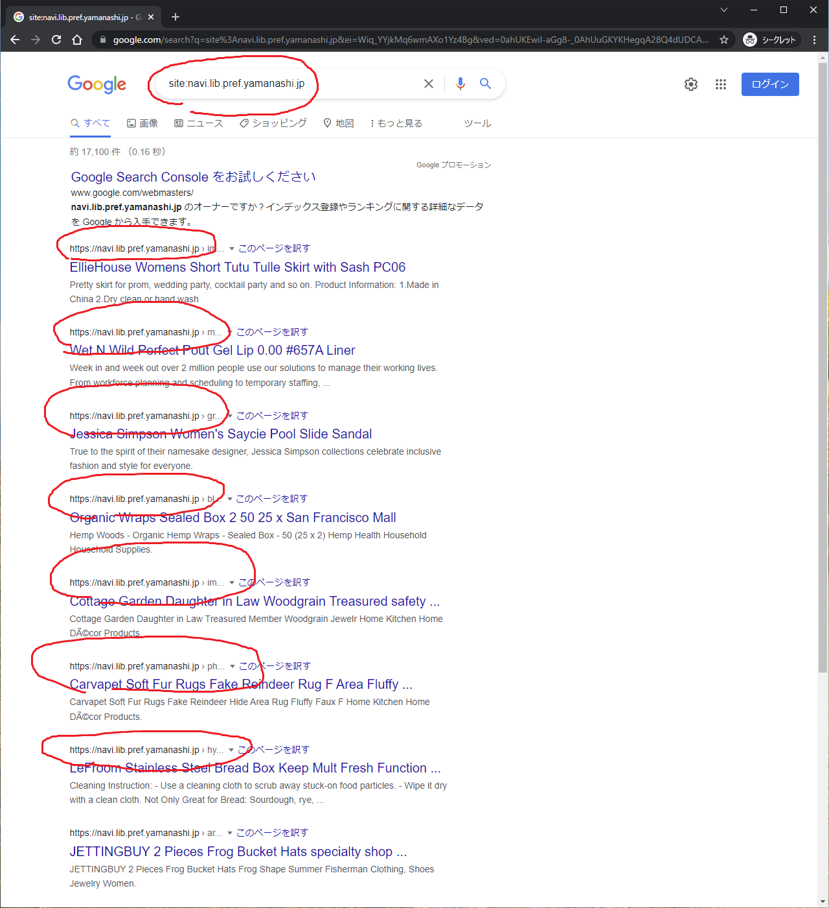
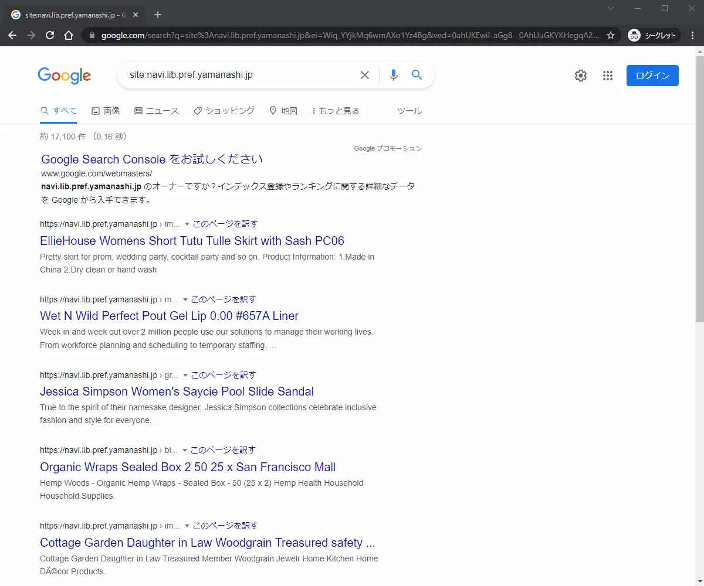
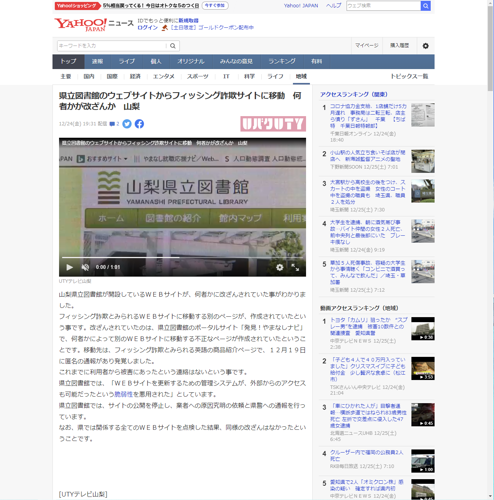

記憶が薄れる前に記録します。

## スマホのケースを探していた、ただそれだけなんだ

時は2021年12月にさかのぼります。Google 検索でスマートフォンのケースを探していて検索結果を進んでいくと、ヒットしているウェブサイトの URL に違和感を感じました。

画像は正常なウェブサイトの例です。

赤く囲った部分は、ウェブサイトに含まれる文字列を抽出して表示しています。`amazon.co.jp` なので日本語が含まれているのは当然ですね。

海外ドメインであれば、大体は日本語で表示されることは少ないのです。`jp.domain.com` や `www.domain.com/jp/`のように日本語向けのページが用意されているようなら別です。検索結果に表示されているウェブサイトは、トップレベルドメインは `.jp` ではないのに日本語が書いてあったんです。

違和感を感じるウェブサイトを、ブラウザのシークレットモードで何個か開くと Not Found や Forbidden でしたが、中には別の URL にリダイレクトしたり、私が利用しているセキュリティ対策ソフト ESET が警告を表示することがありました。

「もしかして、日本の企業が所有するドメインもこういった事例があるのではないか」と、いくつか思い当たるトップレベルドメインを Google で検索してみるとヒットしました。自分が遭遇したのは、個人のブログをはじめ、病院、高等学校、私立大学、企業、不動産、飲食店、ホテル、東京都が管理する公園事務所など多種多様でした。

* `co.jp` - 企業
* `or.jp` - 財団法人や社団法人など企業以外の法人
* `ac.jp` - 18歳以上を対象にした教育機関
* `ed.jp` - 18歳未満を対象にした教育機関
* `go.jp` - 日本の政府機関や各省庁所管の研究所、特殊法人、独立行政法人
* `ne.jp` - ネットワークサービス提供者
* `gr.jp` - 任意団体

地方自治体が所有しているドメインもあります。

* `地域名.jp` - 誰でも登録可能だったので自治体用ではない。[2012年3月31日で新規登録終了](https://jprs.jp/whatsnew/notice/2011/20110926-geo.html)
    * `tokyo.jp` や `kanagawa.jp` など。
* `lg.jp` - 都道府県、市区町村、ただし全国で使用されているわけではなく、`地域名.jp`を使い続ける自治体もある。

地方自治体ではさすがにないだろうなと探してみると、山梨県立図書館が管理しているウェブサイト「発見！やまなしナビ」がヒットしました。
画像のように、URLは「発見！やまなしナビ」なのに、英語のページが大量に作成されています。

実際にクリックしたときの挙動です。まったく別の URL にリダイレクトします。この例では、ファッションサイトですが、中にはアダルトグッズだったりスマートフォンのケースだったり電気工具の部品だったりでした。

ファッションサイトは実際に存在するサイトをコピーしてきたものかと思います。目的は、クレジットカード情報を搾取する、いわゆるフィッシングサイトと思われます。この動作はまだ優しい？方です。

さらには、リダイレクト先に悪意のあるスクリプトが埋め込んであり、閲覧した瞬間にスクリプトが実行されたり、攻撃対象サイト側に悪意のあるスクリプトを仕掛けられる場合もあります。

## どうやって伝えるのが（自分が）安全なのか

私は、インターネットセキュリティや脆弱性の知識豊富の人間ではありません。インターネットがちょっと詳しいだけです。

ウェブサイトが改ざんされている＝お問い合わせフォームも汚染されていると考えて、Twitter アカウントからお知らせ（メンション）したツイートが以下です。

<blockquote class="twitter-tweet">
. <a href="https://twitter.com/lib_pref_ymns?ref_src=twsrc%5Etfw">@lib_pref_ymns</a> こんばんは。Google検索していたら、御社サイトに様々な英語のページが作成され、Googleにインデックスされています（画像はGoogleで「site:<a href="https://t.co/oGvYfZoTIY">https://t.co/oGvYfZoTIY</a>」を検索）。御社サイトは攻撃者に改ざんされており、自由にファイルを作成できる状態にあるようです。（続く） <a href="https://t.co/CXMhzSEMWu">pic.twitter.com/CXMhzSEMWu</a>
&mdash; Kuro (@PRiMENON) <a href="https://twitter.com/PRiMENON/status/1472553760916635648?ref_src=twsrc%5Etfw">December 19, 2021</a></blockquote> 

Twitter をちゃんと活用している場合は良いのですが、情報発信するだけでメンションを見ていない場合もあります。2日後、Twitter に返信があり続きは DM でやりとりしました。内容は、今回の改ざんで私が被害に遭われていないかの確認でした。

その後、UTYテレビ山梨のニュースや読売新聞の記事やYahoo!ニュースにもなったようです。2023年現在、確認できるのは読売新聞の記事だけです。

* [県図書館の運営サイト、いつのまにか詐欺ページ多数…ツイッター書き込みで被害に気づく](https://www.yomiuri.co.jp/national/20211225-OYT1T50089/)　読売新聞オンライン 2022-12-27

UTYテレビ山梨 2021-12-24

## 今はどうなったか

あれから1年以上経過しましたが、依然としてインターネット上には、改ざんされていることのに気づかず運用しているサイトが存在します。

山梨県立図書館の事例は、自治体でしたので早急に対応してもらえました。一方、企業や教育機関のサイトは連絡方法がメールや電話しかなく通報が困難です。どうにもできずに、[JPCERT](https://www.jpcert.or.jp/) に連絡したこともあります。

兎にも角にも、私はインターネットで欲しい情報が安全に探せるようになって欲しい、ただそれに尽きます。
